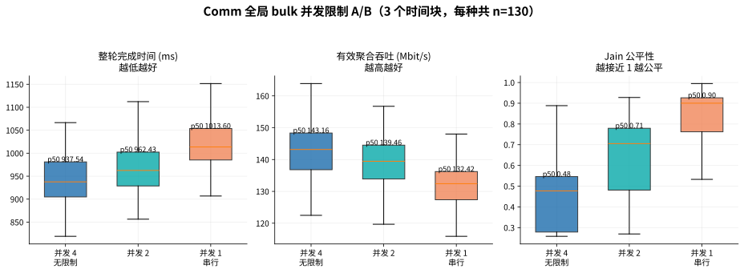
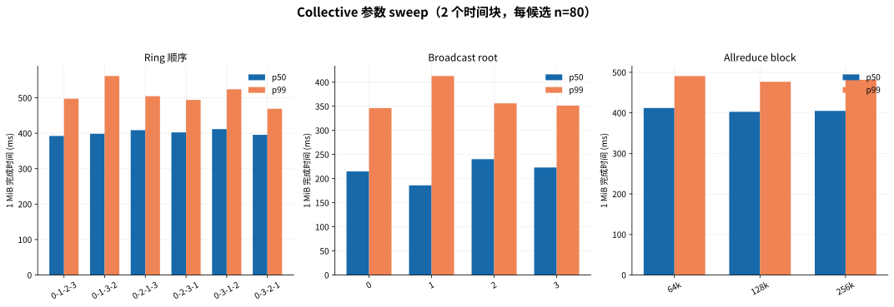

# 四节点 Comm scheduler 与 Collective 参数实验

## 实验问题

本轮不预设 scheduler 一定更快，而是比较相同四节点 Ring、每个 rank 发送 4 MiB、相同总工作量下，同时允许 4、2、1 条 bulk flow 的差异。

聚合吞吐是所有流在单位时间完成的数据量之和；它可能很高，但无法反映某条流是否被饿死。Jain 公平性为：

\[
J=\frac{(\sum_i x_i)^2}{n\sum_i x_i^2}
\]

其中 `1` 表示完全均匀，四条流时理论下限为 `0.25`。本实验的 Jain 根据每条流从进入 TCP 写入到 `drain()` 完成的 service rate 计算；它描述发送服务公平性，不等同于端到端应用公平性。

## Scheduler A/B



数据来自三个不同顺序的时间块，每个并发度共 130 轮。

| 最大同时活跃 bulk 流 | 完成 p50 | 完成 p99 | 有效吞吐 p50 | Jain p50 | Jain p05 |
|---:|---:|---:|---:|---:|---:|
| 4（当前无限制） | 938 ms | 1059 ms | 143.2 Mbit/s | 0.477 | 0.262 |
| 2 | 962 ms | 1119 ms | 139.5 Mbit/s | 0.705 | 0.287 |
| 1 | 1014 ms | 1156 ms | 132.4 Mbit/s | 0.900 | 0.342 |

结论：在这个四流 Ring 工作负载中，限制并发没有改善整体完成时间或 p99。无限制并发的吞吐最高、完成时间最低，但流间公平性明显最差。Scheduler 的价值是隔离和公平，而不是无条件提速。

因此 v0.1 不应默认把 bulk 通信串行化。保留现有 per-peer 队列和 backpressure，并将全局并发限制作为可选策略：吞吐模式允许全部并发；有公平性要求时才限制到 2 或 1。并发 2 只改善典型 Jain，p05 仍很低，不能保证最坏轮次不饥饿。

## Collective 参数



每个候选来自两个随机顺序时间块，共 80 轮。

### Ring

- 当前 `0-1-2-3` 的合并 p50 最低，约 392 ms。
- `0-3-2-1` 的 p99 最低，约 469 ms，当前 Ring 约 498 ms。
- 两个时间块中的名次有变化，差距不足以支持频繁在线切换。
- 单流吞吐矩阵无法准确预测最佳并发 Ring；共享 airtime 的相互作用比单边容量更重要。

建议继续使用 `0-1-2-3` 作为默认 Ring。若明确以尾延迟优先，可以经过更长复验后考虑 `0-3-2-1`。

### Broadcast root

- root 1 的 p50 稳定最快，合并约 186 ms，但 p99 最差，约 413 ms。
- root 0 的 p50/p99 约 215/346 ms，是更均衡的默认值。
- root 2 的跨时间变化最大，不适合作为固定默认值。

建议默认 root 0；吞吐/中位延迟优先模式可选择 root 1，但必须接受更差长尾。

### Allreduce block

- 64/128/256 KiB 的合并 p50 约为 412/403/405 ms。
- 两次测试中的排名发生翻转，差异与 WiFi 时间波动相当。

没有充分证据支持动态 block 调优。保持现有 256 KiB shard 最简单，也避免额外消息和协议开销。

## 对内部感知的约束

内部感知可以做，但不能按一次探测立即切换：

1. 使用完整 collective 完成时间，而不是仅使用 pairwise 吞吐预测拓扑。
2. 同时评价 p50、p99 和公平性，避免用单一指标选出 root 1 这类“典型很快、尾部很差”的方案。
3. 使用较长窗口、EWMA 和滞回；候选需在多个窗口持续改善至少约 10% 才切换。
4. v0.1 先保留静态默认值和观测指标，自动切换放到后续版本。

## 重绘

```bash
/home/user/miniconda3/envs/leisaac/bin/python \
  reports/2026-08-27-comm-sweep/analyze.py \
  --scheduler-run /tmp/wifi_comm_sweep_20260827_full_v1 \
  --scheduler-run /tmp/wifi_comm_scheduler_confirm_seed27 \
  --scheduler-run /tmp/wifi_comm_scheduler_confirm_seed91 \
  --topology-run /tmp/wifi_comm_sweep_20260827_full_v1 \
  --topology-run /tmp/wifi_comm_topology_confirm_seed314
```
