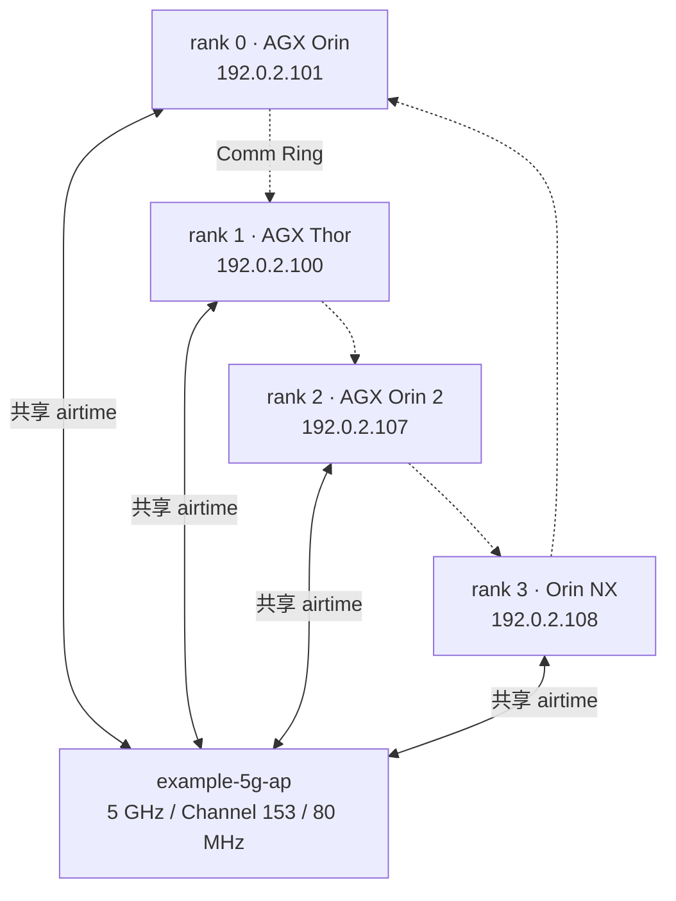
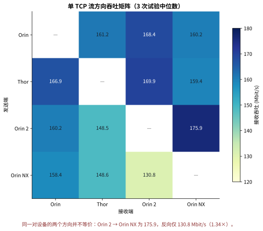
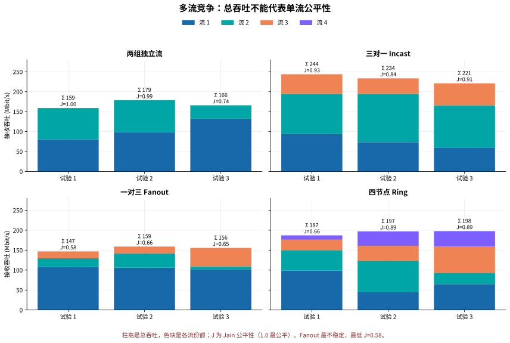
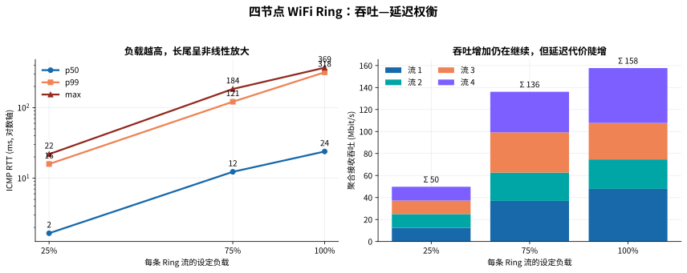
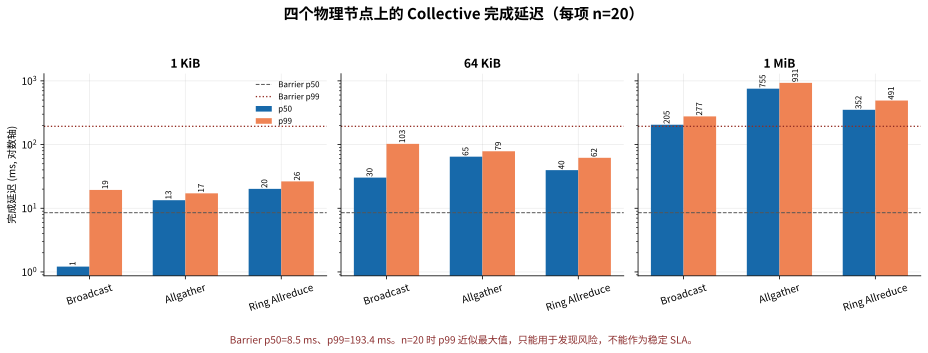

# 四节点 5 GHz WiFi 通信画像

测试拓扑如下。四台设备连接同一个 AP，因此逻辑上的 P2P 或 Ring 并不意味着拥有四条独立物理链路；它们仍在竞争同一个无线信道的 airtime。



## 1. 单流能力不是对称矩阵



单流中位吞吐大多是 148–176 Mbit/s，但方向会显著影响结果。最明显的是 Orin 2 → Orin NX 为 175.9 Mbit/s，反向只有 130.8 Mbit/s，相差 1.34 倍。因此 Ring 顺序和 collective 的 root 选择都可能影响性能。

## 2. 聚合吞吐会掩盖公平性问题



Fanout 的聚合吞吐仍有约 147–159 Mbit/s，看起来并不异常；但单流份额严重失衡，Jain 公平性最低只有 0.58。Incast 的总吞吐最高，但仍存在接收端竞争和流间不均。优化时不能只看 aggregate throughput。

## 3. 负载上升产生明显长尾



25% 负载时 p99 约 13–16 ms；75% 时合并后的 p99 已超过 100 ms；100% 时接近 300 ms。吞吐从约 50 Mbit/s 增加到约 158 Mbit/s，但长尾放大约一个数量级。若通信需要稳定低延迟，持续负载宜先控制在总容量的 40–50%，再通过更长测试校准。

## 4. Collective 会继承并放大无线长尾



1 MiB 时 Broadcast、Ring Allreduce、Allgather 的 p50 分别约 205、352、755 ms；p99 分别约 277、491、931 ms。Barrier 没有 payload，仍出现 p50 8.5 ms、p99 193.4 ms，说明尾部并非仅由数据搬运量决定，还包括共享信道排队和各 rank 到达时间差。

## 当前结论

- 该 WiFi 环境存在真实且不可忽略的瞬时波动。
- 方向不对称存在，拓扑映射不能假设链路等价。
- 多节点并发时，airtime 公平性比单流峰值更重要。
- 75% 以上负载产生严重尾延迟，不适合延迟敏感 collective。
- 当前 collective 每项只有 20 个样本，足够暴露问题，但不足以稳定估计 p99；下一轮应增加到至少 1,000 次并跨时段重复。

## 重绘

```bash
/home/user/miniconda3/envs/leisaac/bin/python \
  reports/2026-08-27-four-node-wifi/generate_plots.py \
  --pairwise-dir /tmp/wifi_four_node_pairwise_20260827 \
  --contention-dir /tmp/wifi_four_node_contention_20260827 \
  --latency-dir /tmp/wifi_four_node_latency_load_20260827 \
  --collective-report /tmp/agx-four-node-collectives.json
```

脚本同时生成 SVG（适合文档和缩放查看）与 PNG（适合分享）。
